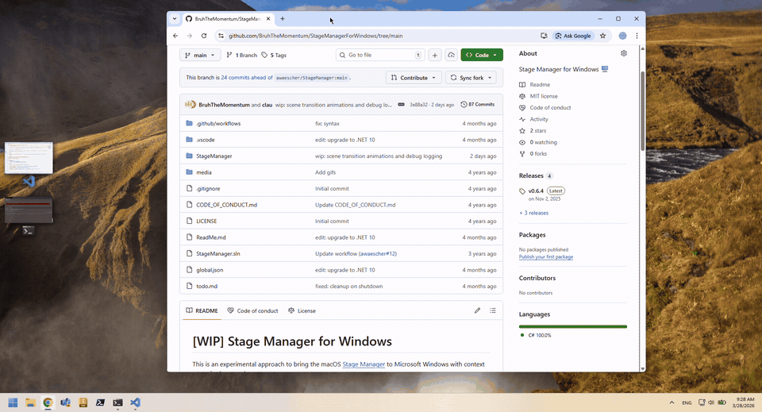

# Stage Manager for Windows

A faithful recreation of macOS [Stage Manager](https://support.apple.com/en-us/HT213315) for Windows. Forked from [awaescher/StageManager](https://github.com/awaescher/StageManager) with the goal of reaching full feature parity with macOS. Currently in beta.



Groups windows by process into "scenes" shown on a sidebar. Switch scenes to focus on one group at a time while others are hidden. Drag windows between scenes to reorganize your workspace.

## Usage

Download and run the executable from the [Releases tab](https://github.com/BruhTheMomentum/StageManagerForWindows/releases/) or build from source:

```bash
git clone https://github.com/BruhTheMomentum/StageManagerForWindows.git
cd StageManager
dotnet run --project StageManager
```

### Requirements
 - Windows 10 version 1607 or newer
 - [.NET 10 SDK](https://dotnet.microsoft.com/en-us/download)

## Roadmap

The goal is a 1:1 match with macOS Stage Manager. Key remaining work:

- **Behaviour alignment** — match macOS scene switching logic, window grouping rules, and edge cases
- **Complete animations** — smooth scene transitions, sidebar fly-in/fly-out, window shuffle effects
- **Multi-monitor support** — independent stage managers per display
- **Visual polish** — 3D perspective thumbnails, proper sizing relative to desktop, adaptive sidebar positioning
- **Drag & drop refinement** — visual feedback, ghost previews, snap-to-scene indicators
- **Smarter window detection** — filter out popups and transient windows (e.g. Teams call toasts) that shouldn't create new scenes

---

Stage Manager is using a few code files to handle window tracking from [workspacer](https://github.com/workspacer/workspacer), an amazing open source project by [Rick Button](https://github.com/rickbutton).
